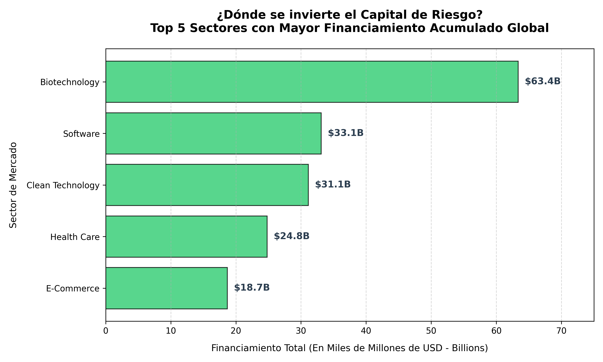

# Análisis de Inversiones Globales de Capital de Riesgo (Venture Capital) 🚀💼

Este proyecto presenta un Análisis Exploratorio de Datos (EDA) enfocado en responder una pregunta estratégica para el ecosistema emprendedor: **¿Es el software el rey absoluto del financiamiento global o existen sectores que logran recaudar más capital?**

El análisis se realizó utilizando un dataset masivo de casi 40,000 registros de startups a nivel mundial, procesado completamente en **VS Code**.

## 🛠️ Tecnologías Utilizadas
* **Lenguaje:** Python 3
* **Librerías:** Pandas (Manipulación avanzada de strings y ETL), Matplotlib (Diseño de gráficos ejecutivos)
* **Entorno de Desarrollo:** VS Code

## 🧽 El Desafío de los Datos (Proceso ETL)
Para poder extraer insights confiables, se realizó un riguroso proceso de limpieza debido a anomalías estructurales en el dataset original:
1. **Limpieza de Columnas:** Se eliminaron espacios en blanco invisibles en los nombres de las columnas (ej. convirtiendo `' market '` a `'market'`) que bloqueaban las consultas de código.
2. **Estandarización Monetaria:** La columna de financiamiento total (`funding_total_usd`) venía formateada como texto con comas y espacios (ej. `" 17,50,000 "`). Se eliminaron caracteres especiales y se forzó la conversión a datos numéricos flotantes, descartando valores nulos o inconsistentes.
3. **Agregación de Métricas:** Se agruparon los datos por sector para calcular el financiamiento total acumulado, el promedio por ronda y el volumen de empresas por mercado.

## 📊 Visualización de Resultados

El siguiente gráfico de barras horizontales, exportado directamente mediante el script de Python, muestra los 5 sectores que lideran la captación de capital a nivel mundial:

## 💡 Conclusiones Clave e Insights de Negocio
* **El volumen no es igual al dinero:** Aunque el sector **Software** lidera en cantidad de empresas (3,324 startups), la **Biotecnología (Biotechnology)** es la reina indiscutible del dinero, acumulando **$63.4B (Mil Millones de USD)**, casi el doble que el software.
* **El costo de la ciencia vs. el código:** Las empresas de Biotecnología y Tecnología Limpia (**Clean Technology**) exigen cheques mucho más grandes de los inversionistas. Clean Tech, por ejemplo, promedia **$35.6M** por empresa, mientras que una startup de software promedio recauda **$9.9M**.
* **Insight Estratégico:** Para un fondo de capital de riesgo o un analista corporativo, el software ofrece más opciones de inversión y diversificación (volumen), pero los sectores científicos (BioTech/CleanTech) absorben la mayor liquidez del mercado debido a sus altos costos de infraestructura y desarrollo.

---
*Proyecto de análisis de datos desarrollado por José Paéz. ¡Conéctate conmigo en [LinkedIn](www.linkedin.com/in/josé-páez-474367417)!*
